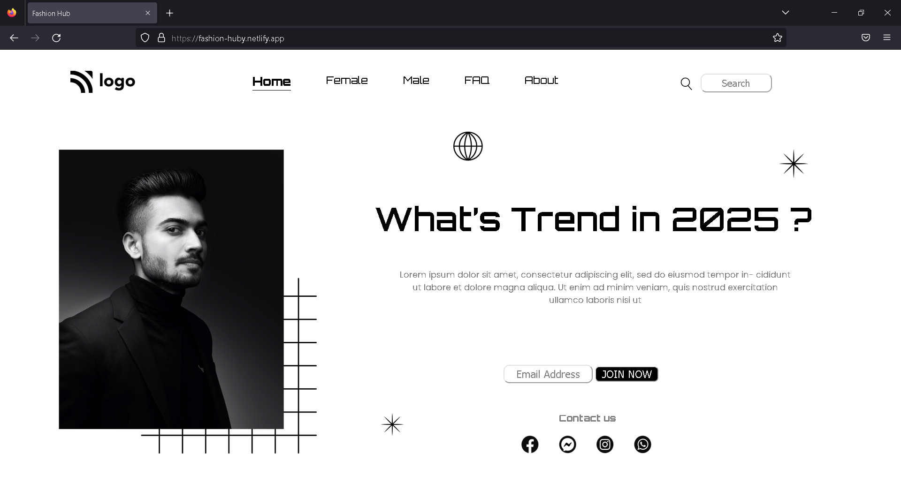

# FSJS 2.0 Project 03

## This was Third Assignment Given In FSJS 2.0 by Ineuron Hitesh Sir and Anurag Sir

### _Assignment_ : [Link](https://github.com/anuragtiwarime/fsjs2/blob/main/Week%2003/readme.md) 

## This is **Fashion Hub** Landing Page created using **HTML** and **CSS** only.

_Live Website_ : [Link](https://fashion-huby.netlify.app/)

### This webpage is  not Completely Responsive as of now .
## **Expected Output:**

## **Achieved Output:**

